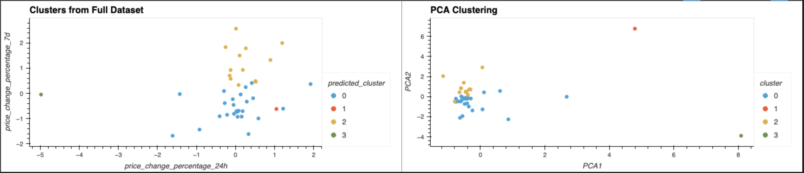

# CryptoClustering
Using Python and unsupervised machine learning techniques, the purpose of this project is to predict whether various cryptocurrencies are affected by 24 hour or 7 day price changes. Two models are created: one using the results from the full dataset and another using the results of Principal Component Analysis (PCA). PCA identifies what factors contribute the most to the data's variability and assigns them a higher weight when forming the final clusters. SciKit Learn and Pandas are the main Python libraries used in this module.

The most optimal value of k, the number of clusters that best represents the data, was determined to be four. Comparing the two models, PCA resulted in tighter clusters, highlighting its ability to remove noise from the visualizations by reducing the number of incorporated variables.

## Data Preparation
To prepare the data, the prioce change percentages within the dataset were normalized using StandardScaler from SciKit Learn. A new Pandas DataFrame was created with the scaled values and their respective cryptocurrencies.

## Finding k using original data and clusters
n elbow curve was created by using 

## Finding k using Principal Component Analysis (PCA) and clusters

## Comparing clusters

The stocks appear to affected 